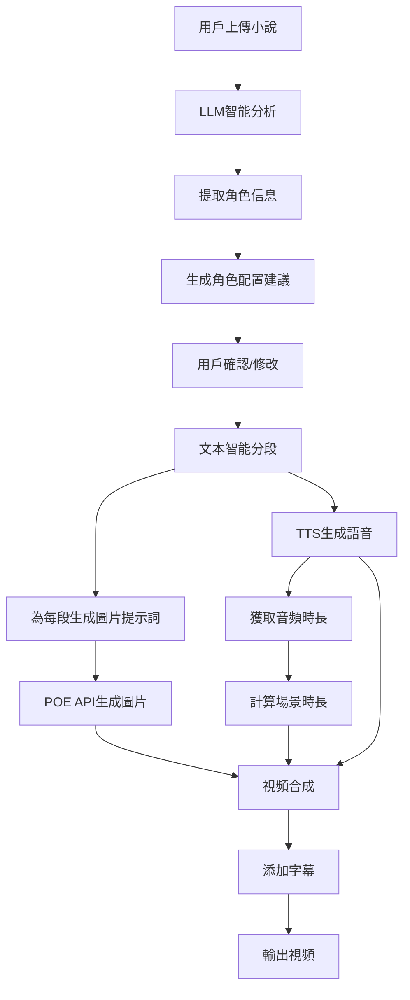
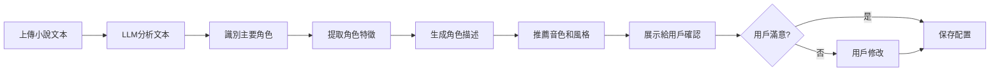
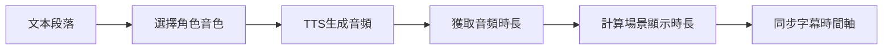
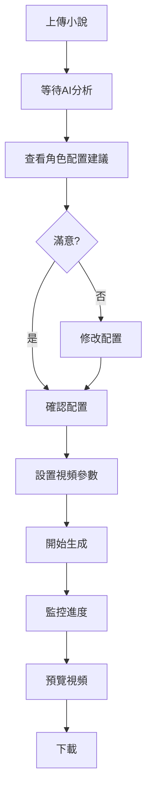
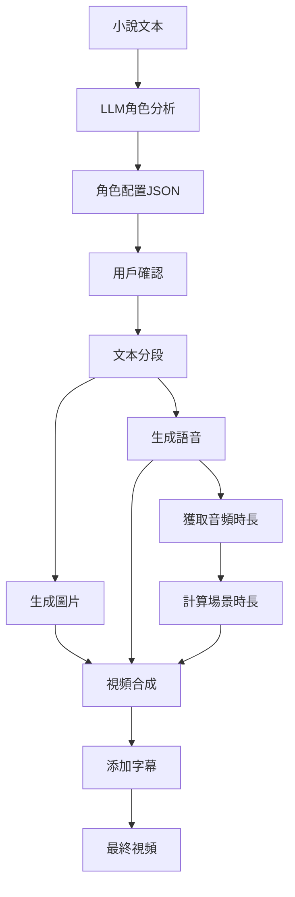

# 小說推文視頻生成系統 - 架構設計 v2

> 本文檔是基於用戶反饋的改進版本

## 核心改進

### 🎯 改進1：場景時長由音頻自動決定
- **原設計**：用戶手動設定每段場景長度
- **新設計**：系統根據TTS生成的音頻時長自動確定場景長度
- **優勢**：更自然、更準確、無需用戶猜測

### 🎯 改進2：智能角色配置
- **原設計**：用戶手動配置每個角色的描述、音色、風格
- **新設計**：LLM自動分析小說提取角色信息，用戶確認後生成
- **優勢**：大幅減少用戶工作量、提升配置準確性

## 系統架構圖



## 改進後的工作流程

### 階段1：智能角色分析（新增）



**LLM分析內容：**
1. **角色識別**
   - 主角、配角、反派等
   - 角色出場頻率
   - 角色重要性評分

2. **角色特徵提取**
   - 外貌描述（髮色、衣著、體型等）
   - 性格特點（冷酷、溫柔、活潑等）
   - 身份背景（劍客、公主、商人等）

3. **自動配置建議**
   - 圖片風格（anime/realistic/fantasy等）
   - 音色推薦（根據性別、年齡、性格）
   - 基礎提示詞模板

**示例輸出：**
```json
{
  "characters": [
    {
      "name": "林軒",
      "role": "主角",
      "importance": 10,
      "appearance": "黑髮白衣的年輕劍客，身材修長，眼神銳利",
      "personality": "冷靜、果斷、正義感強",
      "suggested_voice": "zh-CN-YunxiNeural",
      "suggested_style": "anime style, martial arts",
      "base_prompt": "一位黑髮白衣的年輕劍客，身材修長，眼神銳利"
    },
    {
      "name": "蘇婉兒",
      "role": "女主",
      "importance": 9,
      "appearance": "長髮飄逸的美麗女子，穿著淡藍色長裙",
      "personality": "溫柔、善良、堅強",
      "suggested_voice": "zh-CN-XiaoxiaoNeural",
      "suggested_style": "anime style, elegant",
      "base_prompt": "一位長髮飄逸的美麗女子，穿著淡藍色長裙"
    }
  ]
}
```

### 階段2：文本處理與分段

**分段策略（保持不變）：**
1. 按句子分段
2. 按固定字數分段
3. LLM智能分段（場景變化點）

### 階段3：圖片生成

**提示詞生成流程：**
```
角色基礎描述 + 當前動作/場景 + 風格標籤 → 完整提示詞
```

### 階段4：語音合成與時長計算（改進）



**關鍵改進：**
- 不再需要用戶設定場景長度
- 音頻時長 = 場景時長
- 字幕完全同步音頻
- 圖片顯示時長 = 音頻時長

**時長計算邏輯：**
```python
# 偽代碼
audio_duration = get_audio_duration(tts_output)  # 例如：5.2秒
scene_duration = audio_duration  # 場景時長 = 音頻時長
subtitle_timing = calculate_subtitle_timing(text, audio_duration)
```

### 階段5：視頻合成

**合成邏輯：**
```python
for segment in segments:
    image = segment.image  # 該段落的圖片
    audio = segment.audio  # 該段落的音頻
    duration = audio.duration  # 使用音頻時長
    
    # 圖片顯示時長 = 音頻時長
    video_clip = ImageClip(image).set_duration(duration)
    video_clip = video_clip.set_audio(audio)
    
    # 添加字幕（時間軸已同步）
    video_clip = add_subtitles(video_clip, segment.subtitles)
    
    clips.append(video_clip)

final_video = concatenate_videoclips(clips)
```

## 更新後的API設計

### 1. 智能角色分析API（新增）

**POST /api/analyze-characters**

請求：
```json
{
  "text": "小說全文或前幾章內容",
  "analysis_depth": "basic|detailed"
}
```

響應：
```json
{
  "characters": [
    {
      "name": "角色名",
      "role": "主角|配角|反派",
      "importance": 1-10,
      "appearance": "外貌描述",
      "personality": "性格特點",
      "suggested_voice": "推薦音色ID",
      "suggested_style": "推薦圖片風格",
      "base_prompt": "基礎提示詞"
    }
  ],
  "confidence": 0.85
}
```

### 2. 確認角色配置API（新增）

**POST /api/confirm-characters**

請求：
```json
{
  "characters": [
    {
      "name": "林軒",
      "appearance": "用戶可修改的外貌描述",
      "voice": "用戶選擇的音色",
      "style": "用戶選擇的風格"
    }
  ]
}
```

### 3. 生成視頻API（更新）

**POST /api/generate-video**

請求（簡化）：
```json
{
  "text": "小說文本",
  "characters": "已確認的角色配置",
  "segment_method": "sentence|fixed|smart",
  "resolution": "1080x1920",
  "subtitle_style": "basic|highlight|danmaku|center",
  "fps": 30
}
```

**注意：移除了 `scene_duration` 參數**

## 更新後的前端流程

### 用戶操作步驟



### 前端界面改進

#### 1. 角色分析界面（新增）

```
┌─────────────────────────────────────┐
│  AI正在分析您的小說...              │
│  ▓▓▓▓▓▓▓▓▓▓░░░░░░░░░░ 50%          │
│  已識別3個主要角色                   │
└─────────────────────────────────────┘
```

#### 2. 角色確認界面（新增）

```
┌─────────────────────────────────────┐
│  AI識別的角色配置                    │
│                                     │
│  角色1: 林軒 (主角)                  │
│  外貌: 黑髮白衣的年輕劍客...         │
│  音色: 雲希 (男聲) [修改]            │
│  風格: anime style [修改]           │
│  [✓ 確認] [✗ 刪除]                  │
│                                     │
│  角色2: 蘇婉兒 (女主)                │
│  ...                                │
│                                     │
│  [+ 手動添加角色]                    │
│  [確認所有配置]                      │
└─────────────────────────────────────┘
```

#### 3. 視頻配置界面（簡化）

```
┌─────────────────────────────────────┐
│  視頻設置                            │
│                                     │
│  分段方式: ○ 按句子                  │
│           ● 智能分段                 │
│           ○ 固定字數(100字)          │
│                                     │
│  視頻規格: ● 豎屏 (9:16)             │
│           ○ 橫屏 (16:9)             │
│                                     │
│  字幕樣式: ● 逐字高亮                │
│           ○ 基礎字幕                 │
│           ○ 彈幕滾動                 │
│                                     │
│  ⚠️ 場景時長將自動根據語音長度決定    │
│                                     │
│  [開始生成視頻]                      │
└─────────────────────────────────────┘
```

## 技術實現細節

### 1. LLM角色分析實現

```python
async def analyze_characters(text: str, depth: str = "detailed"):
    """使用LLM分析小說角色"""
    
    prompt = f"""
    分析以下小說文本，提取主要角色信息：
    
    {text[:5000]}  # 取前5000字分析
    
    請以JSON格式返回：
    {{
        "characters": [
            {{
                "name": "角色名",
                "role": "主角/配角/反派",
                "importance": 1-10,
                "appearance": "詳細外貌描述",
                "personality": "性格特點",
                "gender": "male/female",
                "age_range": "young/middle/old"
            }}
        ]
    }}
    """
    
    response = await llm_api.chat(prompt)
    characters = parse_json(response)
    
    # 為每個角色添加推薦配置
    for char in characters:
        char['suggested_voice'] = recommend_voice(
            char['gender'], 
            char['age_range'], 
            char['personality']
        )
        char['suggested_style'] = recommend_style(
            char['appearance']
        )
        char['base_prompt'] = generate_base_prompt(
            char['appearance']
        )
    
    return characters
```

### 2. 音色推薦邏輯

```python
def recommend_voice(gender: str, age: str, personality: str):
    """根據角色特徵推薦音色"""
    
    voice_map = {
        ('male', 'young', 'calm'): 'zh-CN-YunxiNeural',
        ('male', 'young', 'energetic'): 'zh-CN-YunyangNeural',
        ('female', 'young', 'gentle'): 'zh-CN-XiaoxiaoNeural',
        ('female', 'young', 'lively'): 'zh-CN-XiaoyiNeural',
        ('male', 'middle', 'mature'): 'zh-CN-YunjianNeural',
        ('female', 'middle', 'elegant'): 'zh-CN-XiaohanNeural',
    }
    
    key = (gender, age, personality)
    return voice_map.get(key, 'zh-CN-YunxiNeural')  # 默認音色
```

### 3. 時長自動計算

```python
async def generate_video_segment(segment: TextSegment, character_config: dict):
    """生成單個視頻片段"""
    
    # 1. 生成圖片
    image = await generate_image(segment.text, character_config)
    
    # 2. 生成語音
    audio = await generate_tts(
        text=segment.text,
        voice=character_config['voice']
    )
    
    # 3. 獲取音頻時長（關鍵改進）
    audio_duration = get_audio_duration(audio)
    
    # 4. 場景時長 = 音頻時長
    scene_duration = audio_duration
    
    # 5. 計算字幕時間軸
    subtitle_timing = calculate_subtitle_timing(
        text=segment.text,
        duration=audio_duration
    )
    
    # 6. 合成視頻片段
    video_clip = create_video_clip(
        image=image,
        audio=audio,
        duration=scene_duration,  # 使用音頻時長
        subtitles=subtitle_timing
    )
    
    return video_clip
```

### 4. 字幕時間軸同步

```python
def calculate_subtitle_timing(text: str, audio_duration: float):
    """計算字幕顯示時間軸"""
    
    chars = list(text)
    char_count = len(chars)
    
    # 平均每個字的顯示時間
    time_per_char = audio_duration / char_count
    
    timings = []
    for i, char in enumerate(chars):
        start_time = i * time_per_char
        end_time = (i + 1) * time_per_char
        
        timings.append({
            'char': char,
            'start': start_time,
            'end': end_time
        })
    
    return timings
```

## 更新後的數據流



## 優勢總結

### 改進1：自動時長計算
✅ 更自然：場景時長完全匹配語音
✅ 更準確：無需用戶猜測
✅ 更簡單：減少配置項
✅ 更專業：音畫完美同步

### 改進2：智能角色配置
✅ 省時：自動提取角色信息
✅ 準確：AI理解小說內容
✅ 靈活：用戶可以修改
✅ 智能：推薦合適的音色和風格

## 更新後的待辦事項

需要新增的任務：
1. 實現LLM角色分析功能
2. 開發角色配置推薦算法
3. 創建角色確認界面
4. 修改視頻生成邏輯（移除手動時長設定）
5. 實現音頻時長自動計算
6. 更新字幕同步算法

需要修改的任務：
- 視頻配置界面（移除場景時長設定）
- API端點設計（更新參數）
- 前端工作流程（增加角色確認步驟）

## 技術棧（保持不變）

- 後端：Python + FastAPI
- 前端：Vue.js 3 + Element Plus
- TTS：edge-tts（主要）+ pyttsx3（備選）
- 視頻處理：MoviePy
- 圖片生成：POE API
- 文本分析：LLM API (OpenAI Compatible)

## 下一步

請確認這些改進是否符合您的預期，我將更新待辦事項清單。