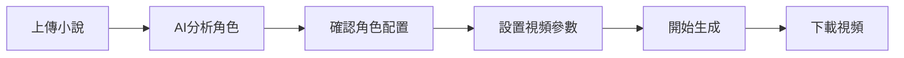

# 小說推文視頻生成系統 - 快速開始指南

## 項目概述

這個系統可以自動將小說文本轉換成帶有AI生成圖片、語音旁白和字幕的短視頻，適合用於抖音、快手等平台的小說推文。

## 核心功能

✅ **智能角色配置（AI驅動）**
- LLM自動分析小說並提取角色信息
- 智能推薦音色和圖片風格
- 用戶只需確認或微調，無需手動配置

✅ **智能文本處理**
- 支持txt、paste text等多種格式輸入
- 智能分段（按句子/固定字數/LLM分析場景）
- 自動提取角色和場景描述

✅ **AI圖片生成**
- 使用POE API生成高質量圖片
- 基於角色配置自動生成提示詞
- 智能補充場景和動作描述

✅ **多樣化配音**
- 支持多種TTS引擎（edge-tts、pyttsx3等）
- 不同角色使用不同音色
- 高質量中文語音合成

✅ **自動時長計算**
- 場景時長完全由音頻時長決定
- 音畫完美同步
- 無需用戶手動設定

✅ **靈活字幕樣式**
- 基礎字幕（底部文字）
- 逐字高亮（抖音效果）
- 彈幕式滾動
- 居中大字顯示

✅ **自定義視頻輸出**
- 多種分辨率（9:16豎屏、16:9橫屏等）
- 可調節FPS和畫質
- 支持批量生成

## 使用流程



### 第一步：上傳小說文本
- 支持直接粘貼文本或上傳txt文件
- 系統會自動識別文本編碼

### 第二步：AI智能分析（新功能）
系統會自動：
- 識別主要角色（主角、配角、反派等）
- 提取角色外貌特徵
- 分析角色性格特點
- 推薦合適的音色
- 建議圖片風格

### 第三步：確認角色配置
- 查看AI生成的角色配置
- 可以修改任何不滿意的地方
- 也可以手動添加新角色
- 確認後進入下一步

### 第四步：設置視頻參數
- **分段方式**：選擇如何分割文本
- **視頻分辨率**：豎屏/橫屏
- **字幕樣式**：選擇喜歡的字幕效果
- ⚠️ **場景時長自動計算**：無需手動設定

### 第五步：開始生成
- 系統會顯示實時進度
- 可以看到每個步驟的狀態：
  - 文本分析中...
  - 生成圖片中...
  - 合成語音中...
  - 計算時長中...
  - 渲染視頻中...

### 第六步：預覽和下載
- 預覽生成的視頻
- 滿意後下載到本地
- 可以直接分享到社交平台

## 工作原理

### 1️⃣ AI智能角色分析（新功能）
```
小說文本 → LLM分析 → 提取角色信息 → 推薦配置 → 用戶確認
```

系統會自動：
- 識別所有重要角色
- 提取外貌描述（髮色、衣著、體型等）
- 分析性格特點（冷酷、溫柔、活潑等）
- 推薦合適的音色（根據性別、年齡、性格）
- 建議圖片風格（anime/realistic/fantasy等）

### 2️⃣ 文本智能處理
系統會分析您的小說文本：
- 將長文本分成適合短視頻的小段
- 提取每段的場景、人物、動作信息
- 為生成圖片做準備

### 3️⃣ AI圖片生成
對每個文本段落：
```
角色配置 + 當前場景 + 動作描述 → 生成提示詞 → POE API → 高質量圖片
```

### 4️⃣ 語音合成與時長計算（改進）
```
文本 → TTS生成音頻 → 獲取音頻時長 → 場景時長 = 音頻時長
```

**關鍵改進**：
- 場景時長完全由音頻決定
- 音畫完美同步
- 無需用戶猜測或手動設定

### 5️⃣ 字幕自動同步
- 分析音頻時長
- 計算每個字的顯示時間
- 渲染選定的字幕效果

### 6️⃣ 視頻合成
將所有元素組合：
```
圖片 + 語音 + 字幕 = 完整視頻片段
```

## 技術亮點

### 🤖 AI驅動
- LLM智能角色分析
- 自動提取角色信息
- 智能推薦配置
- 減少用戶工作量

### ⏱️ 自動時長計算
- 場景時長由音頻決定
- 音畫完美同步
- 無需手動設定
- 更自然的視頻效果

### 🚀 高性能
- 異步處理，多任務並行
- 智能緩存，避免重複生成
- 高效的視頻編碼

### 🎨 高質量
- AI生成的精美圖片
- 自然的語音合成
- 專業的視頻效果

### 🔧 高度可定製
- 豐富的配置選項
- 靈活的模板系統
- 易於擴展新功能

## API配置說明

### POE API
用於生成圖片，需要配置：
- API密鑰
- 選擇的圖片生成模型（如nano-banana）
- 請求格式按照SSE流式處理

### LLM API (OpenAI Compatible)
用於角色分析和文本處理：
- API端點URL
- API密鑰
- 模型名稱

### TTS配置
- edge-tts：無需配置，直接使用（推薦）
- pyttsx3：本地TTS，無需網絡
- 其他TTS：根據需要添加

## 示例配置文件

```json
{
  "poe_api": {
    "endpoint": "https://api.poe.com/v1/chat/completions",
    "api_key": "your-poe-api-key",
    "image_model": "nano-banana"
  },
  "llm_api": {
    "endpoint": "https://api.openai.com/v1",
    "api_key": "your-openai-api-key",
    "model": "gpt-3.5-turbo"
  },
  "video_defaults": {
    "resolution": "1080x1920",
    "fps": 30,
    "subtitle_style": "highlight",
    "segment_method": "smart"
  }
}
```

## 常見問題

**Q: AI角色分析準確嗎？**
A: 系統使用先進的LLM進行分析，準確率很高。如果有不滿意的地方，您可以隨時修改。

**Q: 場景時長如何決定？**
A: 場景時長完全由TTS生成的音頻時長自動決定，確保音畫完美同步。

**Q: 生成一個視頻需要多久？**
A: 取決於文本長度和分段數量。系統會顯示實時進度。

**Q: 支持哪些小說類型？**
A: 支持所有文本類型，但生成效果最好的是場景描述豐富的玄幻、仙侠、都市等類型。

**Q: 圖片質量如何？**
A: 使用POE API的高質量AI圖片生成，效果取決於提示詞質量和選擇的模型。

**Q: 可以自定義字幕樣式嗎？**
A: 可以，系統提供多種預設樣式，也支持自定義字體、顏色、位置等。

**Q: 生成的視頻可以商用嗎？**
A: 請遵守POE API和TTS服務的使用條款。建議使用商業授權的API服務。