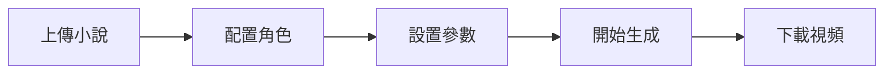

# 小說推文視頻生成系統 - 快速開始指南

## 項目概述

這個系統可以自動將小說文本轉換成帶有AI生成圖片、語音旁白和字幕的短視頻，適合用於抖音、快手等平台的小說推文。

## 核心功能

✅ **智能文本處理**
- 支持txt、paste text等多種格式輸入
- 智能分段（按句子/固定字數/LLM分析場景）
- 自動提取角色和場景描述

✅ **AI圖片生成**
- 使用POE API生成高質量圖片
- 可配置角色外觀和畫風
- 智能生成圖片提示詞（基礎模板 + LLM動態補充）

✅ **多樣化配音**
- 支持多種TTS引擎（edge-tts、pyttsx3等）
- 不同角色可使用不同音色
- 高質量中文語音合成

✅ **靈活字幕樣式**
- 基礎字幕（底部文字）
- 逐字高亮（抖音效果）
- 彈幕式滾動
- 居中大字顯示

✅ **自定義視頻輸出**
- 多種分辨率（9:16豎屏、16:9橫屏等）
- 可調節FPS和畫質
- 支持批量生成

## 使用流程



### 第一步：上傳小說文本
- 支持直接粘貼文本或上傳txt文件
- 系統會自動識別文本編碼

### 第二步：配置角色設定
為每個角色配置：
- **角色名稱**：如"主角"、"女主"等
- **外觀描述**：如"黑髮白衣的年輕劍客"
- **音色選擇**：從多種中文音色中選擇
- **圖片風格**：如"anime style"、"realistic"等

### 第三步：設置視頻參數
- **分段方式**：選擇如何分割文本
- **視頻分辨率**：豎屏/橫屏
- **字幕樣式**：選擇喜歡的字幕效果
- **每段長度**：控制每個場景的時長

### 第四步：開始生成
- 系統會顯示實時進度
- 可以看到每個步驟的狀態：
  - 文本分析中...
  - 生成圖片中...
  - 合成語音中...
  - 渲染視頻中...

### 第五步：預覽和下載
- 預覽生成的視頻
- 滿意後下載到本地
- 可以直接分享到社交平台

## 工作原理

### 1️⃣ 文本智能處理
系統首先會分析您的小說文本：
- 將長文本分成適合短視頻的小段
- 提取每段的場景、人物、動作信息
- 為生成圖片做準備

### 2️⃣ AI圖片生成
對每個文本段落：
```
基礎描述 + 當前場景 + 角色動作 → 生成提示詞 → POE API → 高質量圖片
```

例如：
- 輸入：「他揮劍斬向妖獸」
- 提示詞：「一位黑髮白衣的年輕劍客，正在揮劍攻擊，面對凶猛的妖獸，竹林背景，anime style」
- 輸出：精美的動漫風格圖片

### 3️⃣ 語音合成
- 將文本轉換為自然流暢的語音
- 不同角色說話時使用不同音色
- 自動調整語速和停頓

### 4️⃣ 字幕同步
- 分析音頻時長
- 計算每個字的顯示時間
- 渲染選定的字幕效果

### 5️⃣ 視頻合成
將所有元素組合：
```
圖片 + 語音 + 字幕 = 完整視頻片段
```

## 技術亮點

### 🚀 高性能
- 異步處理，多任務並行
- 智能緩存，避免重複生成
- 高效的視頻編碼

### 🎨 高質量
- AI生成的精美圖片
- 自然的語音合成
- 專業的視頻效果

### 🔧 高度可定製
- 豐富的配置選項
- 靈活的模板系統
- 易於擴展新功能

### 💡 智能化
- LLM驅動的場景理解
- 自動優化提示詞
- 智能文本分段

## API配置說明

### POE API
用於生成圖片，需要配置：
- API密鑰
- 選擇的圖片生成模型（如nano-banana）
- 請求格式按照SSE流式處理

### LLM API (OpenAI Compatible)
用於文本分析和提示詞優化：
- API端點URL
- API密鑰
- 模型名稱

### TTS配置
- edge-tts：無需配置，直接使用
- pyttsx3：本地TTS，無需網絡
- 其他TTS：根據需要添加

## 示例配置文件

```json
{
  "poe_api": {
    "endpoint": "https://api.poe.com/v1/chat/completions",
    "api_key": "your-poe-api-key",
    "image_model": "nano-banana"
  },
  "llm_api": {
    "endpoint": "https://api.openai.com/v1",
    "api_key": "your-openai-api-key",
    "model": "gpt-3.5-turbo"
  },
  "video_defaults": {
    "resolution": "1080x1920",
    "fps": 30,
    "subtitle_style": "highlight",
    "segment_method": "sentence"
  }
}
```

## 常見問題

**Q: 生成一個視頻需要多久？**
A: 取決於文本長度和分段數量。一般來說，每個片段（含圖片生成、語音合成、視頻渲染）需要數秒到數十秒不等。

**Q: 支持哪些小說類型？**
A: 支持所有文本類型，但生成效果最好的是場景描述豐富的玄幻、仙侠、都市等類型。

**Q: 圖片質量如何？**
A: 使用POE API的高質量AI圖片生成，效果取決於提示詞質量和選擇的模型。

**Q: 可以自定義字幕樣式嗎？**
A: 可以，系統提供多種預設樣式，也支持自定義字體、顏色、位置等。

**Q: 生成的視頻可以商用嗎？**
A: 請遵守POE API和TTS服務的使用條款。建議使用商業授權的API服務。

## 下一步

查看詳細的架構文檔：[`architecture.md`](architecture.md)

準備好開始實現了嗎？切換到Code模式開始編碼！